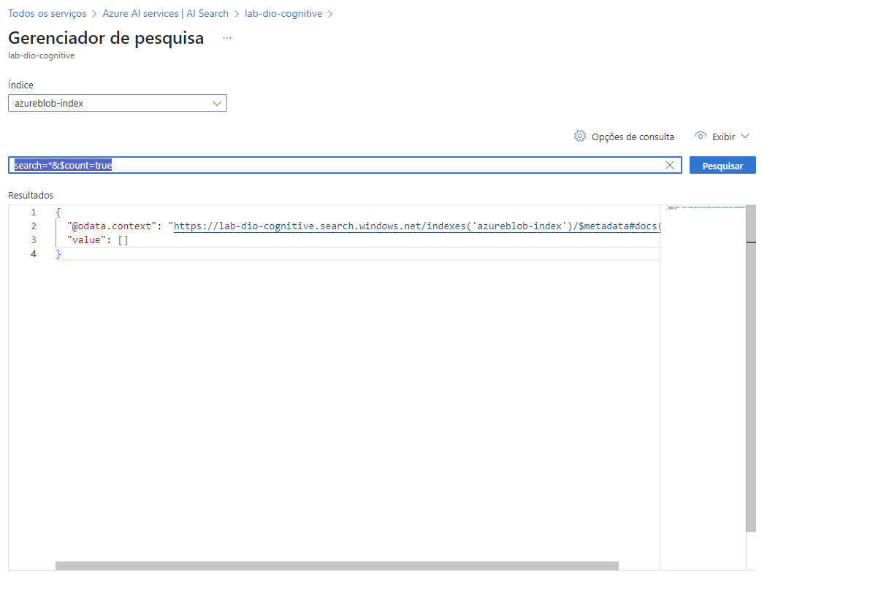
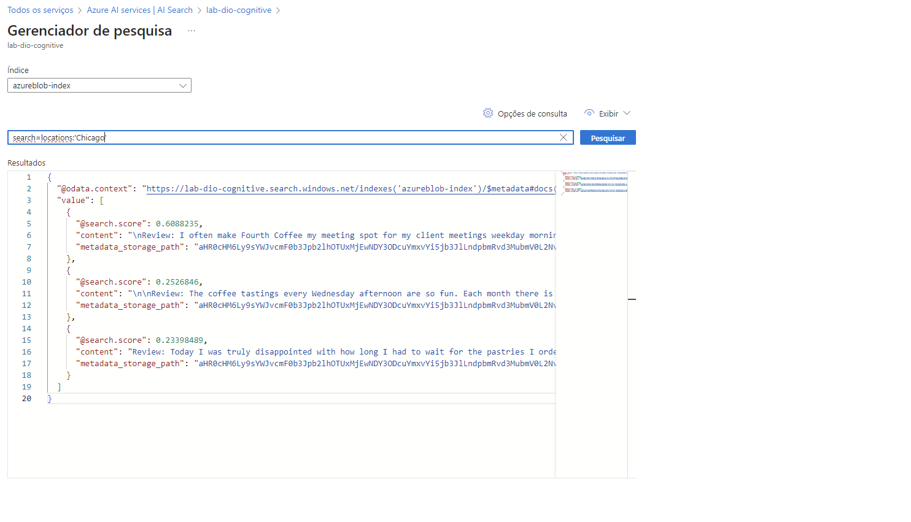

# O que é mineração de Conhecimento?

- Os dados são bloqueados em documentos, PDFs, notas manuscritas, etc
- A mineração de conhecimento encontra insights em escala
- O Azure Cognitive Search é a plataforma de mineração de conhecimento alimentada por IA do azure.

## Soluções de pesquisa Cognitiva do Azure

__Ingestão de dados__

- Azure Blob Storage containers
- Azure Data Lake Storage Gen2
- Azure Table Storage

__Enriquecimento e índice de IA__

- Permite uma compreensão mais profunda
- Visão, Processamento de linguagem natural, etc.
- A indexação torna o conteúdo pesquisável

__Pesquisa Cognitiva do Azure__

- O enriquecimento de IA torna o conteúdo mais útil para fins de pesquisa

__O conteúdo enriquecido é criado por conjuntos de habilidades como:__

- Reconhecer entidades no texto
- Traduzir o Texto
- Avalie o sentimento

__Um conjunto de habilidades produz documentos enriquecidos__

- Consumido durante a indexação
- Os dados serializados são passados ao mecanismo de pesquisa para indexação

## Buscas Cognitivas - LAB

1. Acessar o portal azure
2. Azure AI Services - AI Search
3. Create
4. Selecionar grupo de recursos
5. nome
6. Camada de preços: Basic
7. Create
8. Criar um recurso de serviço cognitivo
9. selecionar grupo de recursos
10. nome
11. tipo de preço: Standard S0
12. Create
13. Criar conta de armazenamento
14. Storage accounts
15. Create
16. selecionar grupo de recursos
17. nome
18. Redundância: LRS
19. create
20. Acessar o storage account criado
21. Acessar configurações
22. nesta etapa do desafio é preciso habilitar o blob anonymous access
23. criar um novo container
24. escolher o nome
25. selecionar container
26. Create
27. baixar o arquivo da documentação oficial da microsoft
28. https://aka.ms/mslearn-coffee-reviews
29. extrair e fazer o upload dos arquivos para o container
30. navegar até o azure ai search
31. clicar no serviço de pesquisa criado
32. importar dados
33. Selecionar azure blob storage
34. criar
35. no ai search, selecionar o lab criado
36. clicar em gerenciador de pesquisa
37. search=*&$count=true (verifica se a indexação esta funcionando e mostra os documentos)
38. 
39. search=locations:'Chicago' ( Consulta as ocorrencias acontecidas em Chicado )
40. 
41. search=sentiment:'negative' ( Consulta as ocorrencias com sentimento negativo )
42. 

